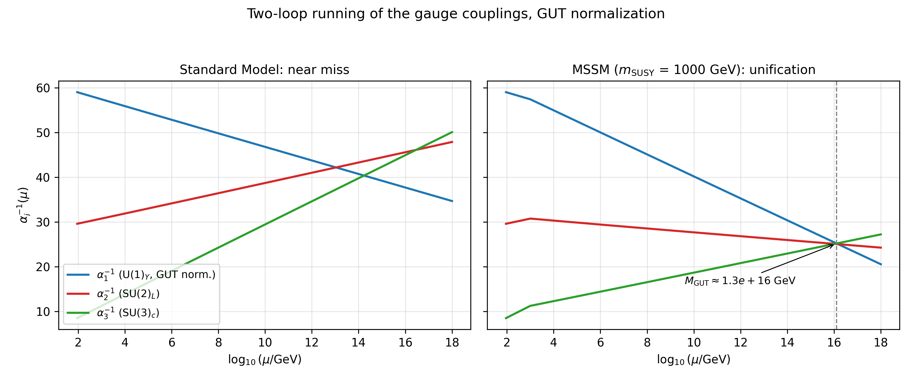

# Grand Unified Theory of Everything (GUToE)

A **pedagogical and computational framework** that organizes the standard
action functionals of fundamental physics — general relativity, the
Standard Model matter and gauge sectors, and the formal loop expansion —
into a single composite expression, and computes the piece of
unification physics that is honestly computable at this level:
renormalization-group gauge-coupling unification and the proton-lifetime
estimate it implies.

## What this is — and is not

**This is:**

- a formal presentation of the composite action with definitions,
  propositions, and a complete symbol glossary
  ([docs/THEORY.md](docs/THEORY.md));
- a from-scratch, reproducible computation of 1- and 2-loop
  gauge-coupling running, the MSSM unification scale, and the proton
  lifetime ([docs/RG_UNIFICATION.md](docs/RG_UNIFICATION.md));
- the SU(5)/SO(10) embedding arithmetic — normalization derived, anomaly
  cancellation verified ([docs/GUT_EMBEDDING.md](docs/GUT_EMBEDDING.md));
- an interactive application with genuine-4D visualization techniques
  (projection and slicing);
- a typeset paper ([paper/](paper/)).

**This is not** a theory of everything. The composite action is an
additive juxtaposition of separately established actions; it unifies
nothing by itself, and this project makes no claim of novel physics. The
project's structure follows an independent academic evaluation (PDF in
this repository's root), whose findings are addressed point-by-point in
[docs/CONCLUSION.md](docs/CONCLUSION.md).

## The composite action

**Definition 1 (organizing framework, not a theorem):**

$$S = S_{\text{gravity}} + S_{\text{matter}} + S_{\text{gauge}} + S_{\text{quantum}}$$

$$S_{\text{gravity}} = \frac{1}{16\pi G}\int d^4x\,\sqrt{-g}\,(R - 2\Lambda),\qquad \Lambda = 1.1056\times10^{-52}\ \text{m}^{-2}\ \text{(Planck 2018)}$$

$$S_{\text{matter}} = \int d^4x\,\sqrt{-g}\left[\bar{\psi}(i\gamma^\mu D_\mu - m)\psi + (D_\mu\phi)^\dagger(D^\mu\phi) - V(\phi)\right]$$

$$S_{\text{gauge}} = -\frac{1}{4}\int d^4x\,\sqrt{-g}\,F^a_{\mu\nu}F^{a\,\mu\nu},\qquad S_{\text{quantum}} = \sum_{n=1}^{\infty}\hbar^n S_n$$

Only the Einstein–Hilbert action enters the gravity sector; the LQG and
string-theoretic actions are presented as competing research programs,
never summed (Remark 1 in [docs/THEORY.md](docs/THEORY.md)).

## Quantitative results



| Model | Loops | M_GUT [GeV] | α_GUT⁻¹ | Mismatch | Unifies | τ_p [yr] |
|---|---|---|---|---|---|---|
| SM | 1 | 6.2×10¹⁴ | 41.9 | 13.1% | no | 7.5×10³⁰ |
| MSSM | 1 | 1.5×10¹⁶ | 25.7 | 2.3% | **yes** | 1.0×10³⁶ |
| SM | 2 | 3.8×10¹⁴ | 41.7 | 11.5% | no | 1.0×10³⁰ |
| MSSM | 2 | 1.3×10¹⁶ | 25.1 | 0.7% | **yes** | 4.5×10³⁵ |

The Standard Model couplings *nearly* meet ("near miss"); the MSSM
couplings unify at M_GUT ≈ 1.3×10¹⁶ GeV. The proton-lifetime estimate
τ_p ~ M_GUT⁴/(α_GUT² m_p⁵) clears the Super-Kamiokande bound
(2.4×10³⁴ yr) at the MSSM point and is excluded by four orders of
magnitude at the SM near-miss scale — the classic demise of minimal
non-supersymmetric SU(5). These are reproductions of known results
(Amaldi–de Boer–Fürstenau 1991; Martin–Ramond hep-ph/9501244), included
because any project speaking about unification must compute what is
computable. Order-of-magnitude caveats and methods:
[docs/RG_UNIFICATION.md](docs/RG_UNIFICATION.md).

## Quick start

```bash
pip install -r requirements.txt

# UI delivery 1 — Streamlit explorer (8 pages incl. Master Equation,
# Gauge Unification, interactive 4D visualizations)
streamlit run streamlit_app.py

# UI delivery 2 — Dash scientific dashboard: panel layout, live RG
# metrics, plus pure-D3.js panels (rotating tesseract, force-directed
# structure map of the composite action)        -> http://127.0.0.1:8050
python3 dash_app.py

# UI delivery 3 — NiceGUI Control Room: a recursive concept tree where
# every concept expands into its parts with increasing complexity and
# ends in an interactive moment; knobs, levers, and a Basic/Advanced/
# Expert menu (Expert turns the PDG inputs into levers)
#                                               -> http://127.0.0.1:8051
python3 nicegui_app.py

# Reproduce the headline numbers in the table above
python3 -m toe_math.rg_running

# Reproduce the SU(5)/SO(10) embedding arithmetic
python3 -m toe_math.gut_embedding

# Build the paper (requires LaTeX: texlive + latexmk)
bash paper/build.sh
```

## Repository map

```
gutoe/
├── streamlit_app.py        # UI delivery 1: Streamlit explorer
├── gutoeUIUX.py            # compatibility shim for the same app
├── dash_app.py             # UI delivery 2: Dash dashboard (+ assets/ D3.js)
├── nicegui_app.py          # UI delivery 3: NiceGUI Control Room
├── version.py              # shared project version (2.0.0)
├── toe_math/               # physics computations
│   ├── rg_running.py       #   RG unification + proton lifetime
│   ├── gut_embedding.py    #   SU(5)/SO(10) group theory
│   ├── master_equation.py  #   formal presentation (single source of truth)
│   └── schumann.py         #   classical-EM appendix (unrelated to unification)
├── visualization/plotly_4d.py  # interactive 4D figures (projection + slicing)
├── docs/                   # canonical documentation — start at docs/index.md
├── paper/                  # the typeset paper (gutoe.tex → gutoe.pdf)
├── tests/                  # physics regression tests + app smoke tests
├── unified/, core/, component_formulas/  # modular formula API (legacy layers)
└── gfx/                    # generated graphics (gfx/rg/ holds the RG figure)
```

The assorted `fix_*.py` / `create_*.py` / `enhance_*.py` scripts in the
root are legacy one-off tooling retained for history; the supported
entry points are the four commands in Quick start.

## Documentation

- [docs/index.md](docs/index.md) — documentation index
- [docs/THEORY.md](docs/THEORY.md) — Definitions 1–5, Remark 1,
  Propositions 1–4, Open Problems 1–5
- [docs/RG_UNIFICATION.md](docs/RG_UNIFICATION.md) — methods and results
- [docs/GUT_EMBEDDING.md](docs/GUT_EMBEDDING.md) — group-theory arithmetic
- [docs/CONCLUSION.md](docs/CONCLUSION.md) — honest assessment and the
  evaluation-response table
- [docs/REFERENCES.md](docs/REFERENCES.md) — bibliography
- [docs/USER_GUIDE.md](docs/USER_GUIDE.md) — install, run, reproduce, build
- `paper/gutoe.pdf` — the typeset paper (after `bash paper/build.sh`)

## Limitations and open problems

1. No single unifying gauge group with full three-generation dynamics —
   only the one-generation group theory is exhibited.
2. No derived inter-sector couplings; the composite action is assembled,
   not derived.
3. Gravitational non-renormalizability (Goroff–Sagnotti 1986) is
   confronted nowhere; the loop expansion presupposes the consistency at
   issue.
4. The gravity-sector research programs (EH quantization, LQG, strings)
   are compared, not selected among.
5. No novel falsifiable prediction beyond the constituent theories.

These are stated precisely in [docs/THEORY.md](docs/THEORY.md) §5; they
are the distance between this framework and a scientific theory of
unification.

## Key references

Georgi & Glashow, PRL 32, 438 (1974) · Georgi, Quinn & Weinberg, PRL 33,
451 (1974) · Goroff & Sagnotti, NPB 266, 709 (1986) · Amaldi, de Boer &
Fürstenau, PLB 260, 447 (1991) · Martin & Ramond, hep-ph/9501244 ·
Super-Kamiokande, arXiv:2010.16098 · ATLAS, arXiv:2010.14293 · Planck
2018, arXiv:1807.06209 · PDG 2024. Full list with citation keys:
[docs/REFERENCES.md](docs/REFERENCES.md).

## Acknowledgment

This project was restructured in 2026 in response to *"Professor
Codephreak's GUToE: An Independent Academic Evaluation of an AI-Assisted
Theory of Everything"* (PDF in the repository root) — a rigorous
external review whose verdict ("a well-constructed toy, not a
discovery") is accepted and incorporated rather than disputed. The
pre-2026 README and documentation are preserved unmodified in
[docs/legacy/](docs/legacy/).

Developed by Professor Codephreak — an AI-assisted project of
Gregory L. Magnusson.
